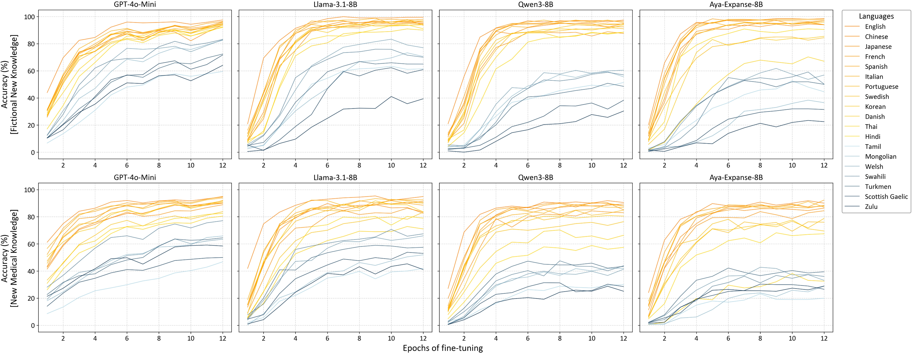
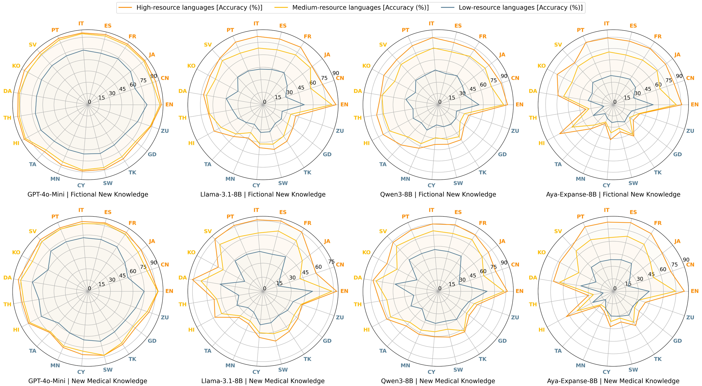
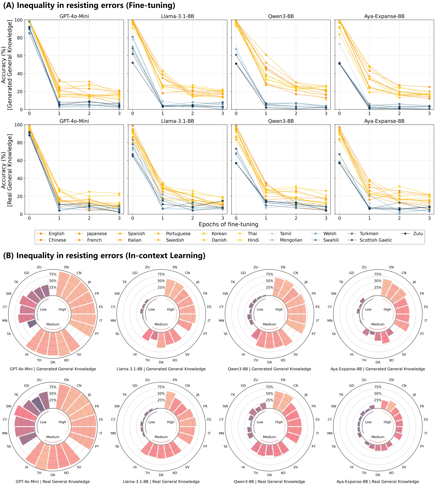
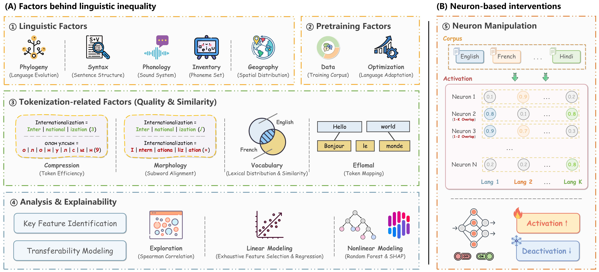

# Linguistic Inequalities in New Knowledge Learning

Welcome to the official repository for our work **"Uncovering inequalities in new knowledge learning by large language models across different languages"**!

## 🌟 Overview


### Research Questions:

As large language models (LLMs) gradually demonstrate their potential to boost productivity and become integral tools for problem-solving in daily life worldwide, understanding the linguistic inequalities they introduce is becoming increasingly important. Prior research has primarily focused on static analyses of disparities in existing knowledge and capabilities of LLMs across languages. However, LLMs are continuously evolving, acquiring new knowledge to provide current, relevant responses and deliver precise, expert-level answers in specific domains. Investigating **linguistic inequalities** within this **dynamic learning process** is, therefore, also essential. In this paper, we explore inequalities in new knowledge learning by LLMs across different languages and four key dimensions:

1️⃣ Equally effective? (Can LLMs learn new knowledge equally effectively across different languages in terms of efficiency and accuracy?)

2️⃣ Equally transferable? (Can the knowledge acquired by LLMs be transferred equally across languages?)

3️⃣ Equally prioritized? (When new knowledge in two languages conflicts, can LLMs treat them equally?)

4️⃣ Equally robust? (When exposed to incorrect or misleading information, can LLMs resist such errors equally across languages?)

We further analyze the underlying causes of these inequalities from linguistic perspectives, pretraining characteristics, and tokenizer design, and propose a preliminary mitigation strategy through the lens of linguistic neurons. This work highlights the urgent need to recognize and address emerging linguistic inequalities in the development of LLMs.

### Codes & Datasets:

This repository provides the complete codebase for reproducing all experimental results reported in the paper. All datasets are included in the Supporting Information as required by the journal. After downloading the datasets, please use Google Translate to translate the content and place the files in the following directory structure:

```
datasets/
└── new_knowledge_datasets/
    ├── generated_new_knowledge.json
    └── real_new_knowledge.json
└── general_knowledge_datasets/
    ├── generated_general_knowledge.json
    └── real_general_knowledge.json
```

## 📦 Setup

To get started, clone the repository and install required dependencies:

```bash
pip install -r requirements.txt
```

## 🚀 Usage Guide

Below is a detailed explanation of how to run the experiments for each research question, including relevant code snippets and expected outcomes.

👉 **Before running experiments:**

1. Store your OpenAI API key in [the configuration file](./src/utils/info.json).
2. Download all tested models in advance:

```bash
cd models
python download_models.py --token <YOUR_HF_TOKEN>
```

### 🔍 Dataset Quality Assessment

We generated parallel QA pairs across **19 languages** and evaluated their translation quality through:

- **Backtranslation consistency** (via GPT-4o)
- **Backtranslation similarity** (cosine similarity using `text-embedding-3-small`)

For the new knowledge datasets, all tested models consistently failed to produce correct answers in any language, which indicates that the knowledge is indeed new to them. In contrast, the models performed well on the two general knowledge datasets and can accurately answer most questions across languages.

```bash
bash scripts/verify_generated_new_knowledge_quality.sh
bash scripts/verify_real_new_knowledge_quality.sh
bash scripts/verify_generated_general_knowledge_quality.sh
bash scripts/verify_real_general_knowledge_quality.sh
```

### 1️⃣ Equally Effective?

We used the constructed new knowledge datasets to evaluate the effectiveness of LLMs in learning new knowledge across different languages through fine-tuning. Results show that lower-resource languages face greater challenges compared to higher-resource ones.

```bash
bash scripts/effectiveness_evaluation.sh
```



### 2️⃣ Equally Transferable?

We tested whether the knowledge acquired by LLMs can be transferred equally across languages and found that new knowledge acquired by LLMs can be more easily transferred to higher-resource languages than to lower-resource ones.

```bash
# In-context Learning Setting
bash scripts/transferability_evaluation_in-context_learning.sh
# Fine-tuning Setting
bash scripts/transferability_evaluation_fine-tuning.sh
```



### 3️⃣ Equally Prioritized?

We further examined how LLMs respond when new knowledge from two different languages conflicts. We found that knowledge in higher-resource languages tends to be prioritized.

```bash
# In-context Learning Setting
bash scripts/prioritization_evaluation_in-context_learning.sh
# Fine-tuning Setting
bash scripts/prioritization_evaluation_fine-tuning.sh
```


### 4️⃣ Equally Robust?

The learning materials used by LLMs, whether stored in databases or retrieved from the internet, may inevitably contain errors. We also investigated how LLMs respond when exposed to such misinformation, and how their susceptibility varies across languages. We found that LLMs are more robust against incorrect or misleading information in higher-resource languages.

```bash
# In-context Learning Setting
bash scripts/robustness_evaluation_in-context_learning.sh
# Fine-tuning Setting
bash scripts/robustness_evaluation_fine-tuning.sh
```



### ✨ Analysis and Modeling of Linguistic Inequalities

We conducted a systematic investigation into the determinants of **cross-lingual performance disparities** and **knowledge transferability** from linguistic perspectives, pretraining characteristics, and tokenizer design:

- For performance disparities, we identified pretraining data proportion and tokenizer quality as key factors;
- For transferability, we found that linguistic properties (phylogenetic, syntactic, and geographic distances), pretraining characteristics (e.g., data proportion and tailored optimization), and tokenization-related metrics (vocabulary overlap and subword alignment) all significantly influence cross-lingual transferability.

Using the identified features, we developed both linear and nonlinear models to predict cross-lingual knowledge transferability. These models achieved high predictive accuracy, with **adjusted R² scores above 0.9** and mean absolute errors (MAE) below 5%.

```bash
bash scripts/cc_lang2vec.sh
bash scripts/tokenization_analysis.sh
bash scripts/correlation_modeling.sh
```



### 🧠 Internal Mechanisms & Mitigation

Finally, we analyzed the internal behavior of LLMs through the lens of linguistic neurons. This analysis helps explain why linguistic inequalities persist. We further explored neuron-based interventions as a potential mitigation strategy and found preliminary evidence that such approaches can help reduce disparities.

```bash
bash scripts/neuron-based_interventions.sh
```


## 📂 Results

All outputs are saved in the `results/` directory by default.

## 🔍 Responsible AI Transparency Information

An AI system includes not only the technology, but also the people who will use it, the people who will be affected by it, and the environment in which it is deployed. Creating a system that is fit for its intended purpose requires an understanding of how the technology works, its capabilities and limitations, and how to achieve the best performance. Microsoft has a broad effort to put our AI principles into practice. To find out more, see [Responsible AI principles from Microsoft](https://www.microsoft.com/en-us/ai/responsible-ai).

### 🧩 Use of the Code and Datasets

Our goal in publishing this code and corresponding datasets is to facilitate reproducibility of our paper in hopes of motivating further research. They are intended to be used by **domain experts** who are independently capable of evaluating the quality of outputs before acting on them. This code should only be used for **research on multilingual LLMs**.  Any real-world applications are **beyond the scope** of this project.

### 🔒 Out-of-scope Uses

Our assets currently do **not** support other languages, models, or datasets beyond the specified scope. If an **unskilled user** attempts to use them outside this scope, the code will fail to function and generate an **error notification**.

### ⚠️ Limitations

- Evaluation limited to **19 languages**: English, Japanese, Chinese, Spanish, French, Italian, Portuguese, Korean, Swedish, Danish, Thai, Hindi, Tamil, Mongolian, Welsh, Swahili, Zulu, Turkmen, Scottish Gaelic.
- Results may not generalize to other languages or **multimodal models**.
- Findings are specific to the **fictional new knowledge**, **new medical knowledge**, and **general knowledge datasets**.

### ✅ Fairness and Responsible AI Testing

At Microsoft, we strive to empower every person on the planet to do more. An essential part of this goal is working to create technologies and products that are fair and inclusive. Fairness is a multi-dimensional, sociotechnical topic and impacts many different aspects of our work.

When systems are deployed, Responsible AI testing should be performed to ensure safe and fair operation for the specific use case. No Responsible AI testing has been done to evaluate this method including validating fair outcomes across different groups of people. Responsible AI testing should be done before using this code in any production scenario.

> Note: The documentation included in this README file is for informational purposes only and is not intended to supersede the applicable license terms.

## 📜 **License**

This project is released under the license in the [LICENSE](./LICENSE) file. See also: [Microsoft Open Source Code of Conduct](https://opensource.microsoft.com/codeofconduct).

## ™️ Trademarks

This project may contain trademarks or logos for projects, products, or services. Authorized use of Microsoft trademarks or logos is subject to and must follow [Microsoft&#39;s Trademark &amp; Brand Guidelines](https://www.microsoft.com/en-us/legal/intellectualproperty/trademarks). Use of Microsoft trademarks or logos in modified versions of this project must not cause confusion or imply Microsoft sponsorship. Any use of third-party trademarks or logos are subject to those third-party's policies.

## 🔗 Contact

For questions, issues, or contributions, please **open an issue** or reach out directly. Let’s work together to bridge gaps in multilingual AI research.